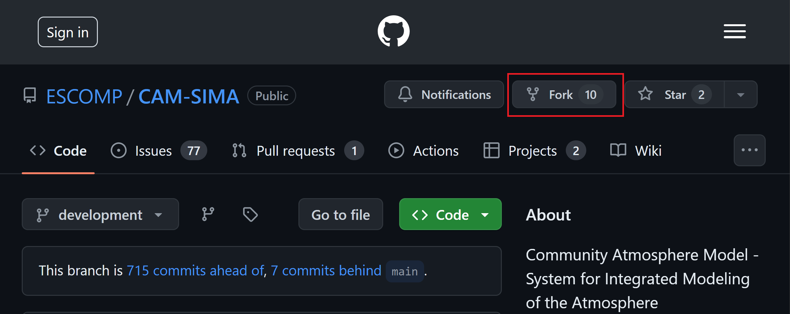
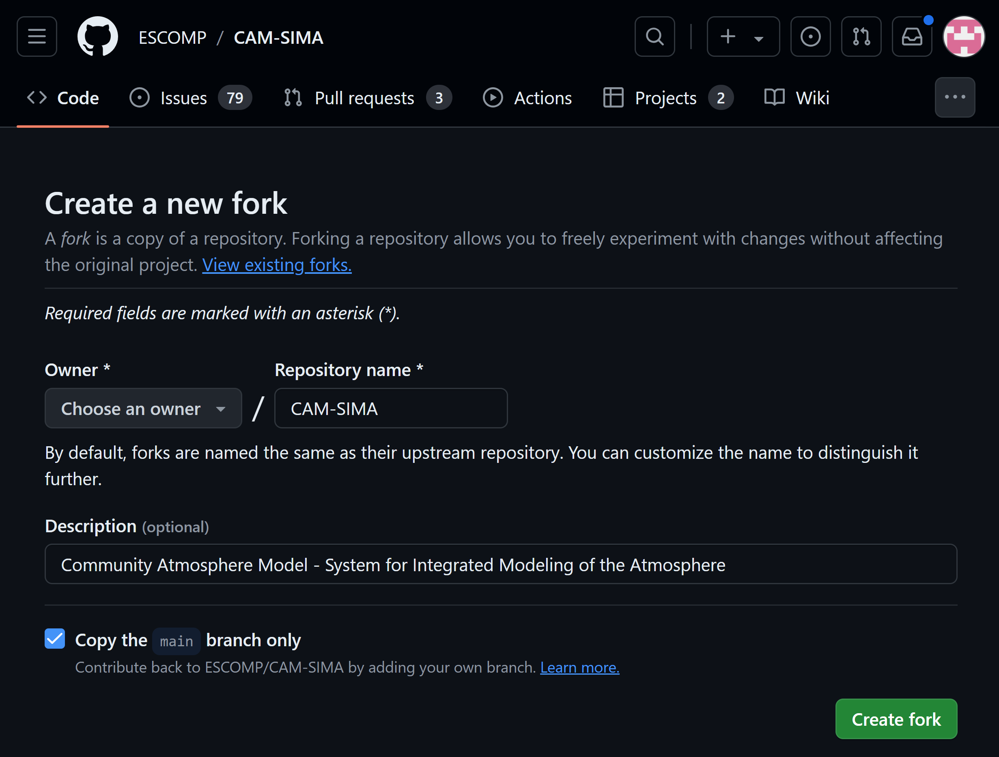

# 0 - Background & Prep work

## Background

### Running jobs in CAM and CAM-SIMA
See [this](../usage/creating-a-case.md) section for how to run CAM-SIMA and CAM.

Depending on which machine you are on, you may prefer to run the ./case.build command on a compute node instead of the login node due to user resource utilization limits on the login nodes.

## Prep Work

### Conversion Spreadsheet
Put the parameterization that you are going to convert into the [conversion spreadsheet](https://docs.google.com/spreadsheets/d/1_1TTpnejam5jfrDqAORCCZtfkNhMRcu7cul37YTr_WM/edit#gid=0).

### Create Github Issues
1. Create a Github Issue in the [ESCOMP/CAM](https://github.com/ESCOMP/CAM) repo that states which physics parameterization you are planning to convert to the CCPP framework.  
1. Create another issue in the [ESCOMP/atmospheric physics](https://github.com/NCAR/atmospheric_physics) repo describing the same physics parameterization that you are now planning to add to the collection of NCAR CCPP physics suites.  Doing this allows the software engineers to keep track of which physics routines are being worked on, and which still need to be assigned.  The goal of converting the physics parameterization is to ultimately have the CCPP-ized physics package reside in [ESCOMP atmospheric physics](https://github.com/NCAR/atmospheric_physics) and be removed from [ESCOMP/CAM](https://github.com/ESCOMP/CAM).

### Setting up your sandbox

Make sure you have github forks for both [ESCOMP/CAM-SIMA](https://github.com/ESCOMP/CAM-SIMA) and [ESCOMP/atmospheric_physics](https://github.com/ESCOMP/atmospheric_physics).  If needed see [Working with git and GitHub](../development/git-basics.md)


To begin, fork ESCOMP/CAM-SIMA:


And select the `Create new fork` option.  This will bring you to the "Create new fork" screen:


!!! warning "Uncheck the "Copy the `main` branch only" option"

    Failure to uncheck this will prevent you from pulling in updates from the `development` branch easily.

#### Set up local clones and branches

- On the machine and in the directory in which you would like to develop, clone CAM-SIMA (the CCPP-ized version of CAM) with your fork as the origin:
```
git clone -o <your_github_userid> https://github.com/<your_github_userid>/CAM-SIMA CAM-SIMA
```

- Navigate into the directory you just created:
```
cd CAM-SIMA
```

- Add the `ESCOMP` remote so you can keep your fork up to date:
```
git remote add ESCOMP https://github.com/ESCOMP/CAM-SIMA
```

- Fetch the upstream ESCOMP tags and branches from GitHub:
```
git fetch --tags ESCOMP
```

- Create and checkout a new branch off of the `development` branch of the ESCOMP remote:
```
git branch <branch_name> ESCOMP/development
git checkout <branch_name>
```

- Set up the upstream (on GitHub) version of your branch:
```
git push -u <your_github_userid> <branch_name>
```

- Populate your externals:
```
bin/git-fleximod update
```

- Make a new directory for your parameterization within the atmospheric_physics submodule directory
```
mkdir src/physics/ncar_ccpp/<parameterization_name>
```

- Navigate into the atmospheric_physics submodule directory
```
cd src/physics/ncar_ccpp
```

- Add your fork of atmospheric_physics as a remote
```
git remote add <your_github_userid> https://github.com/<your_github_userid>/atmospheric_physics
```

- Fetch the upstream branches and tags
```
git fetch <your_github_userid>
```

- Create, checkout, and push a new branch upstream
```
git checkout -b <physics_branch_name>
git push -u <your_github_userid> <physics_branch_name>
```
!!! Warning "Multiple repositories!"
    As you make changes and want to commit them to your github repos, you’ll be managing two separate repos.  When you issue git commands, be aware of where you are in your code tree.

- If you want to see changes in CAM-SIMA, you can issue a “git status” in the main CAM-SIMA directory.
- If you want to see changes in the atmospheric_physics repo, make sure you are in src/physics/ncar_ccpp before you issue the “git status” command.
- All other git commands will be relative to your current working directory as well.

Congratulations! You've set up your sandbox! Proceed to [1 - Convert the "portable" layer](./step1.md)